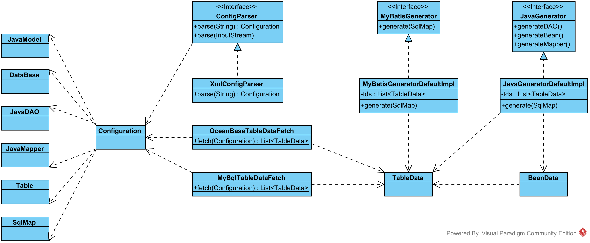
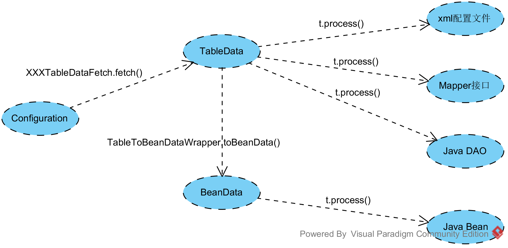
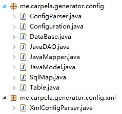
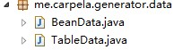
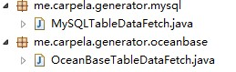
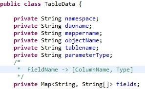
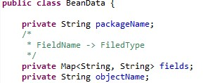

#OMG(OceanBase MyBatis Generator)配置文件生成工具
---
##介绍
官方有一款工具 [MyBatis Generator](http://mybatis.github.io/generator/index.html)，功能强大，但不支持`OceanBase`，以插件的方式定制成本太高，而且如果以后对生成内容做小的修改还需要熟悉代码，所以写了一个OceanBase的简单生成工具。它基于`MVC`的思想:

- 待生成文件以模板的形式作为`View`层
- 生成过程中所需要的数据表示成`Model`层
- 解析配置和生成过程控制作为`Controller`层

采用`freemarker`作为模板引擎，简单的定制只需修改模板即可，无需烦心过多的实现细节。生成的文件包括：

- mapper xml文件
- mapper接口
- 基于SqlSession的DAO文件
- Java Bean

##使用

###打个补丁
本地运行OceanBase错误：

	java.security.InvalidKeyException: Illegal key size or default parameters
	
需要给JDK打一个补丁，请参见网络相关资料。

###配置文件
默认配置文件是classpath下的`generatorConfig.xml`。它是`me.carpela.generator.Generator.doGenerator(String filename)`的参数。

一个典型的配置文件如下：

	<?xml version="1.0" encoding="UTF-8"?>
	<configuration>
		<db type="oceanbase" configURL="http://obconsole.test.alibaba-inc.com/ob-config/config.co?dataId=XXXXX" />
		<javaModel targetPackage="com.carpela.test" targetDir="output" template="template/beanTemplate.java"/>
		<sqlMap targetPackage="com.carpela.test" targetDir="output" template="template/mybatisTemplate.xml"/>
		<javaDAO targetPackage="com.carpela.test" targetDir="output" template="template/daoTemplate.java"/>
		<javaMapper targetPackage="com.carpela.test" targetDir="output" template="template/mapperTemplate.java"/>
		<table name="verify_transfer" objectName="VerifyTransfer" />
		<table name="verify_transfer_environment" objectName="VerifyTransferEnvrionment"/>
	</configuration>

各配置项含义如下：

- db: 数据库相关配置，type表示数据库类型(目前只支持oceanbase)，configURL表示oceanbase的配置路径
- javaModel: 生成Java Bean的相关配置，targetPackage表示包名，targetDir表示文件存放目录，以执行目录作为起始相对路径，template表示使用的模板，以classpath作为起始相对路径，后两者都可以使用绝对路径
- sqlMap: 生成Mapper xml的相关配置，targetPackage表示xml中的namespace，其余同上
- javaDAO: 生成使用SqlSession的查询语句(ibatis方式)，配置项同上。
- javaMapper: 生成Mapper Interface的相关配置，配置项同上，targetPackage一般情况下和sqlMap中该项值相同1
- table: 要生成的表名和Bean名称，可以有多个

1: MyBatis约束Mapper Interface的package和xml配置文件namespace一致，Interface的package、接口名和方法名定位xml中的唯一id

###运行
OMG目前作为一个单独的项目，执行`me.carpela.generator.Generator`类提供的`main()`方法即可。后续提供IDE或Maven的插件实现。

##实现
###整体结构
类图如下，可以看到核心是数据流：

###依赖
OceanBase的数据库驱动是`mysql-connector`的兼容包，数据源使用`Druid`。POM Dependencies如下：

	<dependencies>
		<dependency>
			<groupId>org.mybatis</groupId>
			<artifactId>mybatis</artifactId>
			<version>3.2.8</version>
		</dependency>
		<dependency>
			<groupId>org.freemarker</groupId>
			<artifactId>freemarker</artifactId>
			<version>2.3.20</version>
		</dependency>
		<dependency>
			<groupId>mysql</groupId>
			<artifactId>mysql-connector-java</artifactId>
			<version>5.1.35</version>
		</dependency>
		<dependency>
			<groupId>com.alipay.oceanbase</groupId>
			<artifactId>oceanbase</artifactId>
			<version>2.0.2</version>
		</dependency>
		<dependency>
			<groupId>com.alipay.oceanbase</groupId>
			<artifactId>oceanbase-core</artifactId>
			<version>2.0.7</version>
		</dependency>
		<dependency>
			<groupId>log4j</groupId>
			<artifactId>log4j</artifactId>
			<version>1.2.17</version>
		</dependency>
		<dependency>
			<groupId>commons-lang</groupId>
			<artifactId>commons-lang</artifactId>
			<version>2.6</version>
		</dependency>
		<dependency>
			<groupId>com.alibaba</groupId>
			<artifactId>druid</artifactId>
			<version>1.0.7</version>
		</dependency>
	</dependencies>

###工作流程

1. 解析配置
2. 获取数据
3. 渲染模板

完成 `Configuration->TableData[->BeanData|->模板数据]->生成的文件` 的数据转换。

###解析配置
涉及到的包：`me.carpela.generator.config` 以及 `me.carpela.generator.config.xml`

前者包含配置项的Bean描述。后者是xml形式配置文件的解析类，它使用DOM解析XML，使用一些如`parseSqlMap()`的方法解析具体的项。最终获得`Configuration`对象。

###获取数据
接下来就是利用Configuration获取表的信息，涉及到的包：`me.carpela.generator.data`，`me.carpela.generator.mysql` 及 `me.carpela.generator.oceanbase` 等

获取表信息包括：
	
- 字段名
- 相应类型

方式主要是利用`metadata`，而`oceanbase`对`DatabaseMetaData`的支持不完善2，但是对`ResultSetMetaData`的支持是完善的。所以在`OceanBaseTableDataFetch`的静态方法`fetch()`中使用一条`select`语句获得后者，并利用`getColumnName()`，`getColumnCount()`,`getColumnType()`,`getColumnTypeName()`获得上述信息。

2: 亲测无法使用`getTables()`获得表结构

此时，已经取得两部分信息：配置项和表信息。对它俩进一步封装和组合，形成与配置中的`table`一一对应的`TableData`，表信息对应于`fields`字段，Key是Bean对象的属性名，Value是两个元素的数组，第一个是数据表对应列名以及JDBC类型名。该对象直接用于渲染sqlMap xml模板。

默认的Bean属性命名方式是驼峰式，两者之间的名字转换是使用`me.carpela.generator.util.StringUtility.camelName()`。

而对于Java Bean，TableData包含的信息过于丰富，直接用于渲染Bean模板会导致模板中要使用冗余的控制标签。所以提供了BeanData类，并提供了`me.carpela.generator.java.TableToBeanDataWrapper`类用于转换。

`fields`字段Key是Bean对象的属性名，Value是Java类型。其中利用了`me.carpela.generator.type.JavaTypeResolver`完成由JDBC类型到Java类型的转换。

###渲染模板
使用`freemarker`作为模板引擎，页面中使用的一些常用语法如下：
	
	<#-- 变量赋值 -->
	<#assign var = val>

	<#-- 遍历序列 -->
	<#list var as item>
	${var}	
	<#-- 变量名_has_next 表示是否有下一元素 -->
	<#if item_has_next><#else></#if>
	</#list>

	<#-- 遍历Map -->
	<#list var?keys as mKey>
	</#list>

	<#-- 字符串处理: 首字母大写 -->
	${str?cap_first}

更详细的语法请参考[官方手册](http://freemarker.org/docs/index.html)。

默认的beanTemplate如下：

	package ${packageName};

	import java.util.Date;
	
	public class ${objectName} {
		<#list fields?keys as field>
		
		private ${fields[field]} ${field};
		
		public ${fields[field]} get${field?cap_first}()
		{
			return ${field};
		}
		
		public void set${field?cap_first}(${fields[field]} ${field})
		{
			this.${field} = ${field};
		}
		</#list>
		
	}

需要的数据即`BeanData`。

默认的daoTemplate如下：

	package ${daoPackageName};
	
	import org.apache.ibatis.session.SqlSession;
	import java.util.List;
	
	public class ${daoName} {
	
		private SqlSession session;
		
		public List<${objectName}> select(${objectName} object)
		{
			return session.selectList("${namespace}.${daoName}.select", object);
		}
		
		public int update(${objectName} object)
		{
			return session.update("${namespace}.${daoName}.update", object);
		}
		
		public int delete(${objectName} object)
		{
			return session.delete("${namespace}.${daoName}.delete", object);
		}
		
		public int insert(${objectName} object)
		{
			return session.insert("${namespace}.${daoName}.insert", object);
		}
		
		public int updateById(${objectName} object)
		{
			return session.update("${namespace}.${daoName}.updateById", object);
		}
		
		public int deleteById(String id)
		{
			return session.delete("${namespace}.${daoName}.deleteById", id);
		}
	}

默认的mapperTemplate如下：

	package ${mapperPackageName};
	
	import java.util.List;
	
	public interface ${mapperName} {
	
		public List<${objectName}> select(${objectName} object);
		
		public int update(${objectName} object);
		
		public int delete(${objectName} object);
		
		public int insert(${objectName} object);
		
		public int updateById(${objectName} object);
		
		public int deleteById(String id);
	}

这两者所需的数据相对比较简单，直接通过键值对传入。
	
	Map<String,String> data = new HashMap<String,String>();
	data.put("objectName", td.getObjectName());
	data.put("daoName", td.getDaoname());
	data.put("namespace", td.getNamespace());
	data.put("daoPackageName", javaDAO.getTargetPackage());

默认mybatisTemplate如下：

	<?xml version="1.0" encoding="UTF-8" ?>
	<!DOCTYPE mapper PUBLIC "-//mybatis.org//DTD Mapper 3.0//EN" "http://mybatis.org/dtd/mybatis-3-mapper.dtd" >
	<mapper namespace="${namespace}.${daoname}">
		<resultMap id="BaseResultMap" type="${parameterType}">
			<#list fields?keys as mKey>
			<result property="${mKey}" <#assign item = fields[mKey]>
				<#list item as tmp>
				<#if tmp_has_next> 
					column="${tmp}"
				<#else> 
					jdbcType="${tmp}"
				</#if>
				</#list>
				/>
				</#list>
		</resultMap>
		<sql id="dynamic">
			<trim prefix="where" prefixOverrides="and">
			<#list fields?keys as mKey>
			<if test="${mKey} != null">
				and <#assign item = fields[mKey]><#list item as tmp><#if tmp_has_next>${tmp}</#if></#list> = <#noparse>#{</#noparse>${mKey}}
			</if>
			</#list>
			</trim>
		</sql>
		<sql id="updateDynamic">
			<trim prefix="set" prefixOverrides=",">
			<#list fields?keys as mKey>
			<if test="${mKey} != null">
			<#assign item = fields[mKey]>
			<#list item as tmp>
			<#if tmp_has_next>
				,<#if mKey == "gmtModified">${tmp}=CURRENT_TIMESTAMP()<#else>${tmp}=<#noparse>#{</#noparse>${mKey}}</#if>
			</#if>
			</#list>
			</if>
			</#list>
			</trim>
		</sql>
		<select id="select" parameterType="${parameterType}" resultMap="BaseResultMap">
			select * from ${tablename}
			<if test="_parameter != null" >
				<include refid="dynamic"/>
			</if>
		</select>
		<insert id="insert" parameterType="${parameterType}">
			insert into ${tablename} (<#list fields?keys as mKey><#assign item = fields[mKey]><#list item as tmp><#if tmp_has_next>${tmp}</#if></#list><#if mKey_has_next>,</#if></#list>) 
			values (
			<#list fields?keys as mKey>
				<#if mKey == "gmtCreate">CURRENT_TIMESTAMP()<#else><#noparse>#{</#noparse>${mKey}}</#if><#if mKey_has_next>,</#if>
			</#list>
			)
		</insert>
		<update id="update" parameterType="${parameterType}">
			update ${tablename} set
				<#list fields?keys as mKey>
				<#assign item = fields[mKey]>
				<#list item as tmp>
				<#if tmp_has_next>
					<#if mKey == "gmtModified">${tmp}=CURRENT_TIMESTAMP()<#else>${tmp}=<#noparse>#{</#noparse>${mKey}}</#if><#if mKey_has_next>,</#if>
				</#if>
				</#list>
				</#list>
			<if test="_parameter != null" >
				<include refid="dynamic"/>
			</if>
		</update>
		<delete id="delete" parameterType="${parameterType}">
			delete from ${tablename}
			<if test="_parameter != null" >
				<include refid="dynamic"/>
			</if>
		</delete>
		<update id="updateById" parameterType="${parameterType}">
			update ${tablename} 
				<include refid="updateDynamic"/>
			where
				id=<#noparse>#{</#noparse>id}
		</update>
		<delete id="deleteById" parameterType="java.lang.String">
			delete from ${tablename}
			where id=<#noparse>#{</#noparse>id}
		</delete>
	</mapper>

所需数据即TableData。

以上模板渲染的方式基本一致，核心代码如下(去掉异常捕获)：

	File outFile = new File(param.getTargetDir()+"/"+td.getDaoname() + ".java");
	Writer out = new BufferedWriter(new OutputStreamWriter(new FileOutputStream(outFile), "UTF-8"));
	Configuration config = new Configuration();
	config.setDefaultEncoding("utf-8");
	config.setClassForTemplateLoading(JavaGeneratorDefaultImpl.class, "/");
	Template t = config.getTemplate(param.getTemplate());
	t.process(data, out);
	out.close();

###约束以及问题

- 如果数据库存在`gmt_modified`列，并且update时设置了该字段，将使用OceanBase的`CURRENT_TIMESTAMP()`字段代替该值。可以通过修改模板替换该设置。
- update和delete需进一步按照具体需求修改才可使用。其它CURD可以直接使用。

##定制

###生成文件
涉及静态信息，直接修改模板即可。如果需要添加数据，按照上述模板渲染描述所需数据添加即可。

###配置项
为了实现更多的功能，更灵活的配置而修改或添加配置项，一般性步骤如下：

1. 修改配置文件
2. 修改配置文件的Bean描述
3. 修改`ConfigParser`的实现类
4. 配置项利用

###更多数据库支持
MySQL的支持并不完善，配置项解析(JDBC连接)没有完成，`MySQLTableDataFetch.fetch()`方法为空。完善这两项即可。

对于其他数据库，在`Generator.doGenerate()`添加类型判断，并实现相应的fetch方法即可。